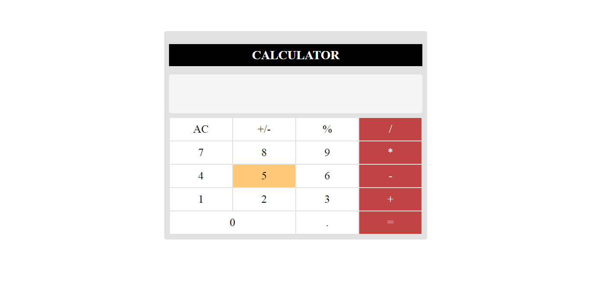

# Simple Calculator Project

Welcome to the Simple Calculator project! This is a basic calculator web application that allows you to perform simple algebraic operations like addition, subtraction, multiplication, and division. The calculator also includes features such as keyboard event handling and hover effects for better user interaction.

## Table of Contents

- [Features](#features)
- [Getting Started](#getting-started)
- [Usage](#usage)
- [Keyboard Events](#keyboard-events)
- [Additional Features](#additional-features)
- [Contributing](#contributing)
- [License](#license)

## Features

- Basic algebraic operations: addition, subtraction, multiplication, and division.
- Hover effect: Numbers and operation buttons are highlighted on hover.
- Keyboard events: Perform calculations using keyboard input.
- Click and keyboard event compatibility: The calculator works seamlessly with both click and keyboard inputs.
- Clear functionality: Clear the display and reset the calculator.

## Getting Started

1. Clone the repository to your local machine using `git clone https://github.com/ritik7739/calculator-project.git`.
2. Navigate to the project directory.
3. Open `index.html` in a web browser to use the calculator.

## Usage

1. Click on the number buttons and operation buttons to enter expressions.
2. The current expression is displayed in the calculator's display area.
3. Click the `=` button or press the `Enter` key to calculate the result.
4. The result will be displayed in the calculator's display area.
5. To clear the display and start a new calculation, click the `AC` button.

## Keyboard Events

The calculator supports keyboard events for a seamless user experience. You can use the following keys:

- Numbers: `0-9`
- Operations: `+`, `-`, `*`, `/`, `%`
- Decimal point: `.`
- Equals: `Enter`
- Clear: `Escape`

## Additional Features

Feel free to enhance the calculator by adding more advanced features:

1. **Scientific Operations**: Implement scientific functions like square root, exponentiation, trigonometric functions, etc.
2. **Memory Functions**: Add memory storage and retrieval for numbers.
3. **History**: Keep a history of previous calculations.
4. **Responsive Design**: Make the calculator responsive for different screen sizes.

## Contributing

Contributions are welcome! If you have ideas for improvements or new features, feel free to submit a pull request.

1. Fork the repository.
2. Create a new branch: `git checkout -b feature-new-feature`.
3. Commit your changes: `git commit -m 'Add a new feature'`.
4. Push the branch: `git push origin feature-new-feature`.
5. Create a pull request.

## License

This project is licensed under the [MIT License](LICENSE).
